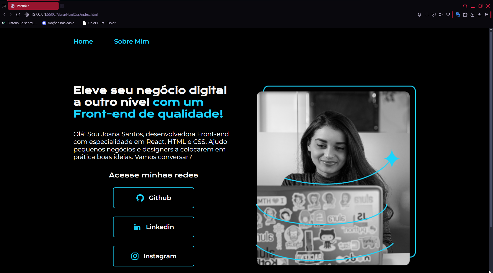

_Olá, esse é um projeto de **portfólio** do curso de **HTML** e **CSS** da **Alura**._

Abaixo a imagem do projeto para melhor visualização.

### Ferramentas utilizadas:

* HTML
* CSS

## Feito por:

### Breno Sampaio

### Linkedin: www.linkedin.com/in/brenosampdev
